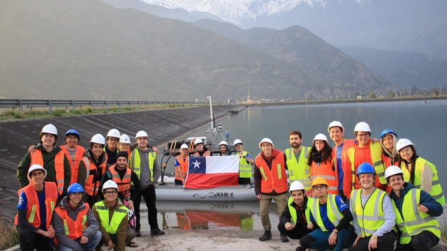
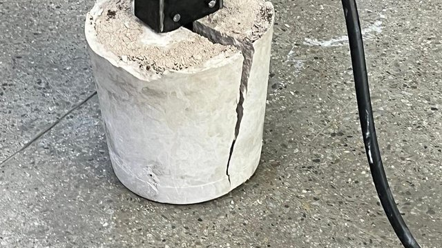
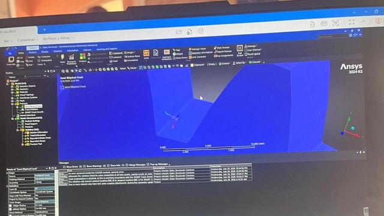
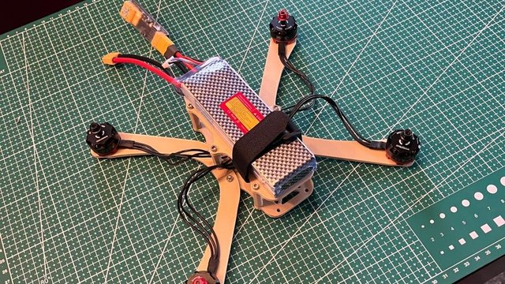
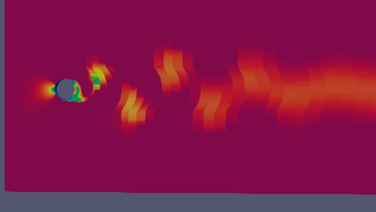
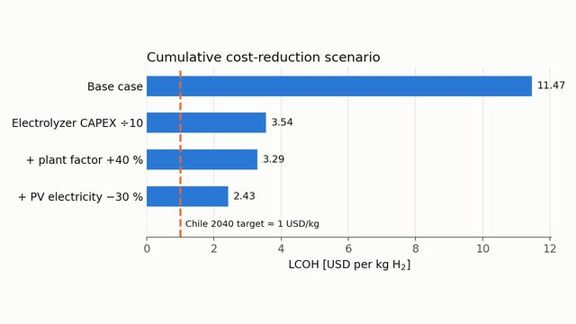

<h1 align="center">Hi, I'm Fernando Saavedra 👋</h1>

<p align="center">
  <a href="https://git.io/typing-svg"></a>
</p>

<p align="center">
  <a href="https://www.linkedin.com/in/fernando-saavedra-paredes-341850239"></a>
  <a href="mailto:fer.saavedra.paredes@gmail.com"></a>
  <a href="https://github.com/fdosaavedra"></a>
</p>

<p align="center">
  📍 <b>Boston, MA</b> &nbsp;|&nbsp; 🎓 <b>MSc Robotics & Autonomous Systems @ Boston University</b> &nbsp;|&nbsp; 🇨🇱 <b>Mechanical Engineer, PUC Chile</b>
</p>

---

## 🚀 About Me

I'm a mechanical engineer who likes building things that move, sense and survive the real world. My background combines **precision mechanical design, simulation (CFD and FEA) and hardware integration**, from an autonomous marine catamaran that competed internationally to a hydraulic rock splitter that cracked a concrete block on demo day.

I'm currently pursuing an **MSc in Robotics and Autonomous Systems at Boston University** (coursework: Applied Machine Learning, Medical Robotics), where I'm adding autonomy and learning-based methods to that mechanical foundation.

- 🌊 Competed at **RobotX 2024** (Sarasota, FL) with an autonomous catamaran: **5th of 15 international teams** in Design Documentation and winner of the **Gusto & Search Pattern Demonstration Award**
- 💨 **+103% downstream wake velocity** by optimizing a propeller guard with OpenFOAM
- 🌡️ Cut sensor housing peak temperatures from **120 °C to 85 °C** using thermal imaging and redesigned heat fins
- 📄 **First author** of a fatigue crack propagation paper accepted at **CIBIM 2026** (Cusco, Peru)
- 🛠️ Currently building a 3D-printed **FPV quadcopter** from scratch

---

## 💻 Tech Stack

**Robotics & Programming**<br>


**Simulation**<br>


**CAD & Manufacturing**<br>


**Machine Learning & Tools**<br>


---

## 🛠️ Featured Projects

<table>
  <tr>
    <td width="50%" valign="top">
      <a href="https://github.com/fdosaavedra/robotx-caleuche-mechanical"></a>
      <h3>🌊 RobotX 2024: Autonomous Catamaran</h3>
      <b>Inventor · OpenFOAM · Thermal imaging · 3D printing</b><br>
      Modular sensor mast, sensor housings and propeller guard for Team Caleuche UC's autonomous surface vessel. +103% wake velocity, 120 → 85 °C housing temperatures.<br>
      🔗 <a href="https://github.com/fdosaavedra/robotx-caleuche-mechanical">Repository</a>
    </td>
    <td width="50%" valign="top">
      <a href="https://github.com/fdosaavedra/hydraulic-rock-splitter"></a>
      <h3>🪨 Hydraulic Rock Splitter</h3>
      <b>Inventor · FEA · Hydraulics · Manufacturing</b><br>
      Capstone project for the Municipality of Puente Alto: a hydraulic wedge system designed, simulated, machined and tested. It split a concrete block at the final demo.<br>
      🔗 <a href="https://github.com/fdosaavedra/hydraulic-rock-splitter">Repository</a>
    </td>
  </tr>
  <tr>
    <td width="50%" valign="top">
      <a href="https://github.com/fdosaavedra/gear-fatigue-crack-propagation"></a>
      <h3>⚙️ Fatigue Crack Propagation in a 3D-Printed SS316L Gear</h3>
      <b>ANSYS Mechanical · SMART Crack Growth · LEFM</b><br>
      Numerical study of tooth-root crack growth under cyclic bending, compared with experimental fatigue data. First-author paper accepted at CIBIM 2026.<br>
      🔗 <a href="https://github.com/fdosaavedra/gear-fatigue-crack-propagation">Repository</a>
    </td>
    <td width="50%" valign="top">
      <a href="https://github.com/fdosaavedra/fpv-quadcopter-build"></a>
      <h3>🚁 3D-Printed FPV Quadcopter</h3>
      <b>Inventor · PETG printing · SpeedyBee F405 V4 · Betaflight</b><br>
      Custom frame designed over three iterations, solving prop clearance, battery mounting, stack cooling and cable routing. Motor tests and PID setup done, first flight coming soon.<br>
      🔗 <a href="https://github.com/fdosaavedra/fpv-quadcopter-build">Repository</a>
    </td>
  </tr>
  <tr>
    <td width="50%" valign="top">
      <a href="https://github.com/fdosaavedra/openfoam-cfd-simulations"></a>
      <h3>💨 OpenFOAM CFD Simulations</h3>
      <b>OpenFOAM · ParaView</b><br>
      Backward-facing step, vortex shedding behind a cylinder and a thermal study of the RobotX sensor housings.<br>
      🔗 <a href="https://github.com/fdosaavedra/openfoam-cfd-simulations">Repository</a>
    </td>
    <td width="50%" valign="top">
      <a href="https://github.com/fdosaavedra/green-hydrogen-lcoh"></a>
      <h3>⚡ Green Hydrogen Cost Model (LCOH)</h3>
      <b>Python · Techno-economic analysis</b><br>
      Levelized cost of hydrogen from solar PV electrolysis in Atacama, Chile, with sensitivity analysis and a cost-reduction pathway. Based on my 2021 undergraduate research.<br>
      🔗 <a href="https://github.com/fdosaavedra/green-hydrogen-lcoh">Repository</a>
    </td>
  </tr>
</table>

**More projects**
- 🧠 [PINN surrogate for Navier-Stokes](https://github.com/fdosaavedra/pinn-navier-stokes-surrogate): physics-informed neural network trained on OpenFOAM data (DeepXDE, TensorFlow)
- 🚌 **Electric air compressor for an electric bus**: 2-stage, 4-piston boxer compressor reaching **12.95 bar** (target 10 bar) and **320 L/min FAD**. I led the CAD (Inventor) and structural FEA (ANSYS). *Repository coming soon.*

---

## 💼 Experience

**Operations Engineer · EOX** · Santiago, Chile · *May 2026 to Jul 2026*<br>
Automated supply chain and data workflows with Google Apps Script, cleaned data for 1,500+ SKUs and led a USD 40,000 sourcing initiative with 20+ suppliers in China.

**Engineering Intern, Towage Department · CPT Empresas Marítimas** · *Jan 2025 to Mar 2025*<br>
Migrated a maintenance management system covering 45+ tugboats, reviewed maintenance plans for CAT 3500 and Cummins KTA engines, and wrote 10+ system-check procedures.

**Mechanical Team Member · Caleuche UC RobotX** · *Jul 2023 to Dec 2024*<br>
Mechanical design, CFD and thermal management for an autonomous marine catamaran. See the [project repository](https://github.com/fdosaavedra/robotx-caleuche-mechanical).

---

## 📚 Education

| Institution | Degree | Date |
|---|---|---|
| **Boston University** | MSc, Robotics and Autonomous Systems | Expected Dec 2027 |
| **Pontificia Universidad Católica de Chile** | B.Sc., Industrial Civil Engineering, Mechanical Engineering specialization | Dec 2025 |
| **Pontificia Universidad Católica de Chile** | B.Sc., Mechanical Engineering | Dec 2024 |

**Teaching & leadership:** TA for Fluid Mechanics and Manufacturing Processes · Coordinator of a 20-person instructor team (UC Pre-University Program) · Orientation leader for 900+ first-year engineering students

---

## 📄 Research

- **Saavedra P., F.**, Ramos-Grez, J., Alvear, B., & Marian, M. *Fatigue crack propagation under cyclic bending in a 3D-printed SS316L gear: experimentation and numerical simulation.* XVII Iberoamerican Congress of Mechanical Engineering (CIBIM 2026), Cusco, Peru. [Abstract](https://github.com/fdosaavedra/gear-fatigue-crack-propagation)
- **Saavedra, F.**, & Pérez de Arce, M. *Reducing green hydrogen costs through solar PV electrolysis in Chile.* PUC Undergraduate Research Program (IPre), 2021. [Code & report](https://github.com/fdosaavedra/green-hydrogen-lcoh)

---

## 🎯 Current Focus

```python
fernando = {
    "location": "Boston, MA",
    "studying": "MSc Robotics & Autonomous Systems @ Boston University",
    "building": ["FPV quadcopter (first flight soon)", "Computer vision project"],
    "interests": ["Autonomous vehicles", "Marine robotics", "Medical robotics", "Simulation-driven design"],
    "looking_for": "Robotics, mechanical design and simulation opportunities",
    "languages": ["Spanish (native)", "English (fluent, IELTS 8/9)"],
}
```

---

## 📫 Let's Connect

<p align="center">
  <a href="https://www.linkedin.com/in/fernando-saavedra-paredes-341850239"></a>
  <a href="mailto:fer.saavedra.paredes@gmail.com"></a>
</p>

<p align="center">
  
</p>
